# IMPORTANT

**Please note that this guide is still largely a work in progress.**

This is written by work study student Christopher Deng, so [contact me](mailto:c.deng@mail.utoronto.ca) if you have any suggestions or questions about this guide.

Unfortunately, since this is a Markdown file, there is no easier way to 'collaborate' on this. With that being said, you can always email me with additions or fixes. In the meantime, I will keep uploading the updated .pdf files to Microsoft Teams > New College IT > General > Files

# Introduction

This documentation will walk you through the installation of Ubuntu 24.04 (Noble Numbat) server (without a GUI) in a VirtualBox OR UTM virtual machine. 

Additionally, we’ll cover how to ensure network connectivity and how to fully deploy a WordPress generic site on LAMP (Linux, Apache, MySQL, Perl/PHP/Python). 

# Installing VirtualBox or UTM 
The downloads can all be found on the [VirtualBox Downloads](https://www.virtualbox.org/wiki/Downloads) page. Ensure that you download the latest version. 

**Windows**

1. Visit the [VirtualBox Downloads](https://www.virtualbox.org/wiki/Downloads) page 

2. Look for ‘Windows hosts’ and click on the link to download 

**MacOS (READ FIRST)**

For Mac systems, please first check whether you’re using Apple Silicon or Intel: 

1. On the top left of your screen, click the  Apple Menu and select ‘About This Mac’ 

2. Look at ‘Chip’ or ‘Processor’. If it says something like M1, M2, or M3, you’re on Apple Silicon. Otherwise, ‘Intel’ indicates that it’s running an Intel processor. 

**MacOS (Apple Silicon)**

VirtualBox does not work well with Apple Silicon. Instead, we can use UTM. 
1. Visit the [UTM Downloads](https://mac.getutm.app/) page
2. Choose whichever method you prefer; I did the direct download instead of app store. 

**MacOS (Intel)**
1. Visit the [VirtualBox Downloads](https://www.virtualbox.org/wiki/Downloads) page
2. Look for macOS / Intel hosts’ and click on the link to download 

# Creating and Configuring the VirtualBox Virtual Machine 

**Download Ubuntu 24.04 LTS Server install image**

1. Go to the [Ubuntu 20.04 downloads](https://releases.ubuntu.com/noble/) page and click ‘64-bit PC (AMD64) server install image’ to download the ISO.

**Create a new Virtual Machine**
1. Open VirtualBox and click ‘New’
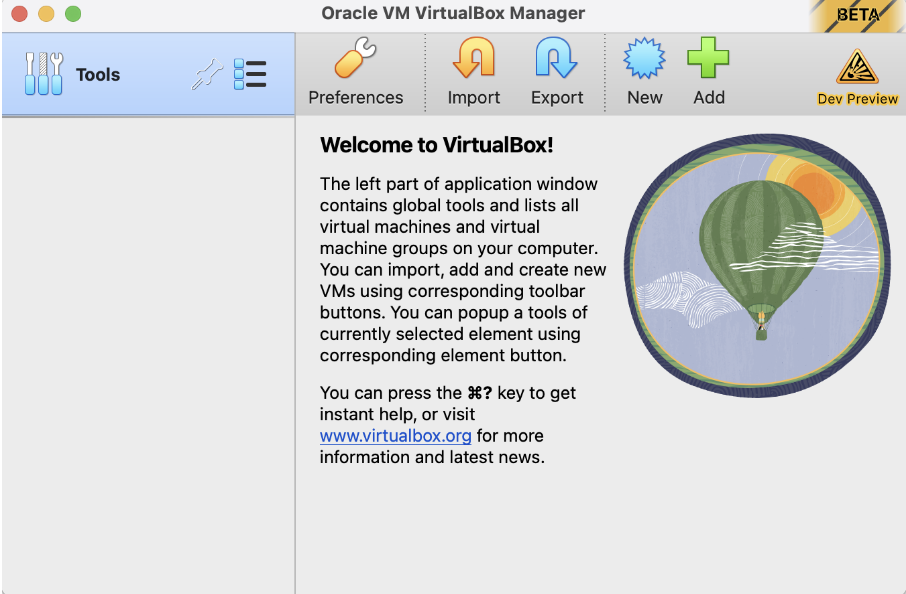

2. **Virtual machine Name and Operating System** 
   
   Fill in the fields appropriately. First, give the Virtual Machine a name, such as ‘Ubuntu Server 24.04’. This should automatically fill out the rest of the fields, such as Type and Version. Otherwise, match the fields appropriately. You can leave the default folder, and do not mount any ISOs just yet. 
   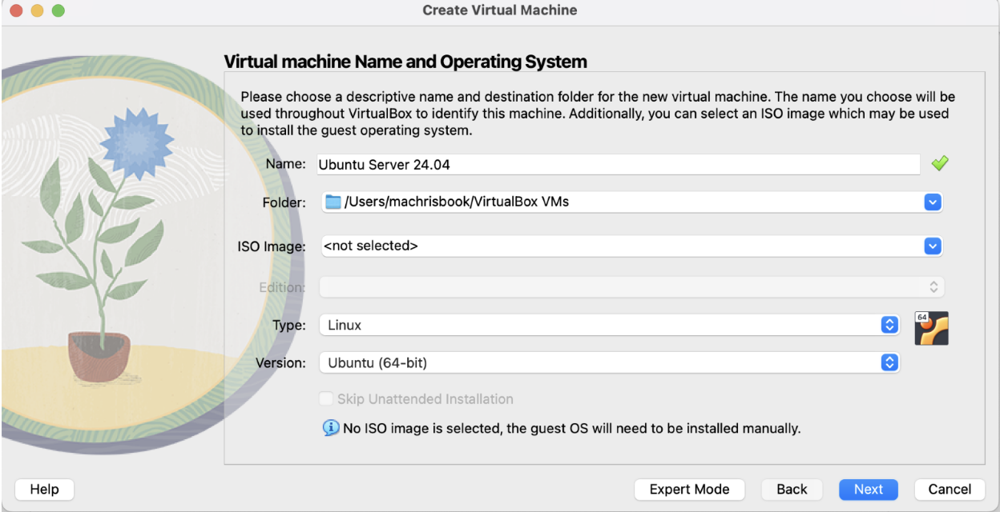

3. **Hardware**
    
    a. **Base Memory**: 1GB is enough 

    b. **Processors**: 1 processor should also suffice, but you can add more if you want (for better performance) 

    c. **Enable EFI**: for simplicity (especially for a GUI-less server), we’ll leave it off 

    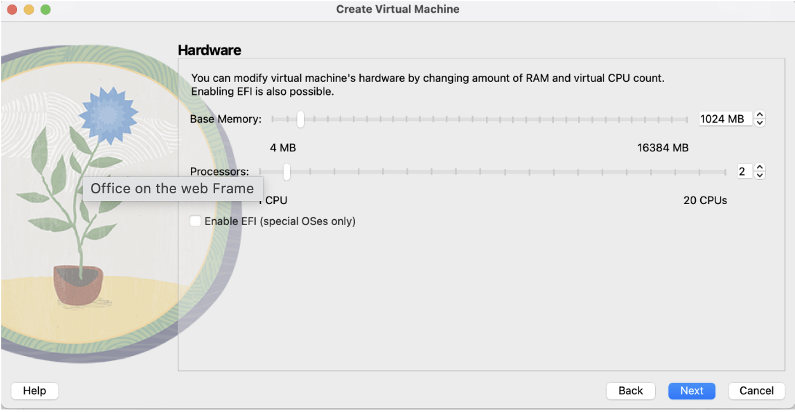

4. **Virtual Hard Disk**

    You want to Create a Virtual Hard Disk Now. Set it to at least 10 GB. 

    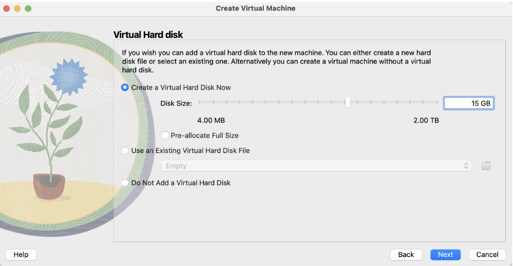

5. After you finish the virtual machine creation wizard, you should be back at the home page. With your newly created VM, click on the ‘Settings’ cog to change the Storage and Network fields. 

    a. **Storage**

    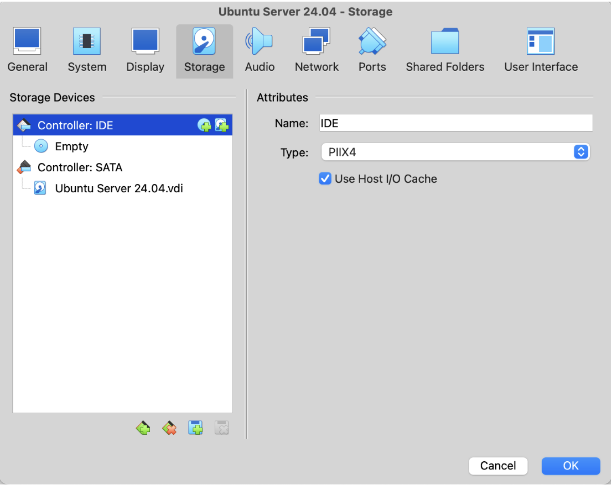

    Click on the empty optical drive and attach the Ubuntu ISO you downloaded earlier. Your list should now look like this: 

    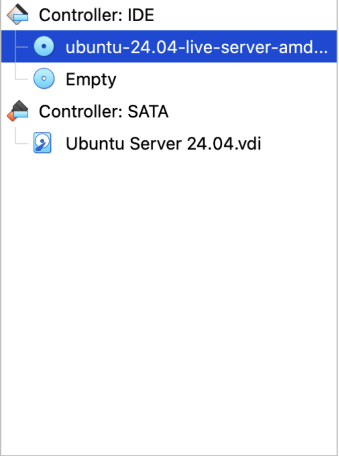

    b. **Network**

    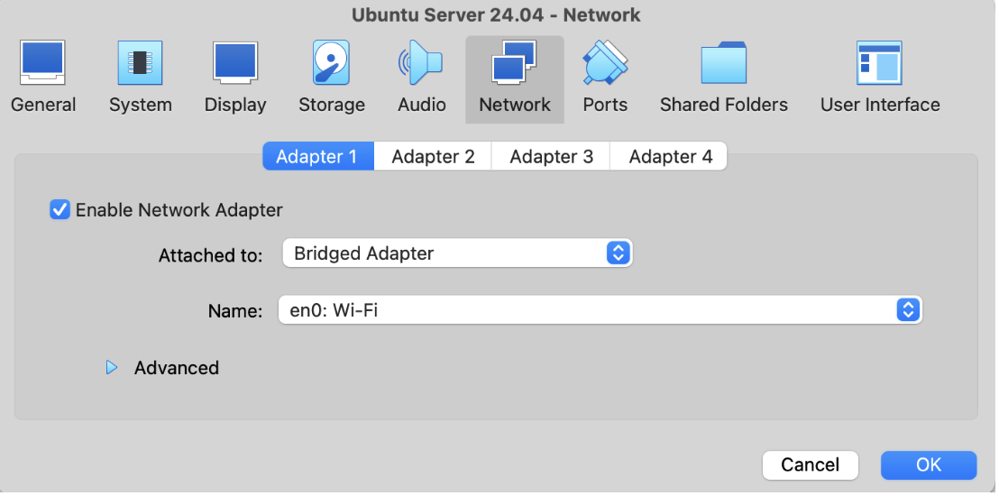

    Change the Attached to field to ’Bridged Adapter’ for network access.

    For the Name, choose whatever you’re connected to:

    **en0** – choose this if you’re connected via Wi-Fi 

    **en1, en2, en3** – choose this if you’re using a Thunderbolt Ethernet adapter
    
    **en4, en5, en6** – choose this if you’re connected via Ethernet  

# Installing Ubuntu 20.04 LTS Server 

Work in progress...

# Verifying Network Connectivity 

Run the following command to send an infinite amount of packets, and press CTRL + C to stop sending packets.

```
ping.google.com
```

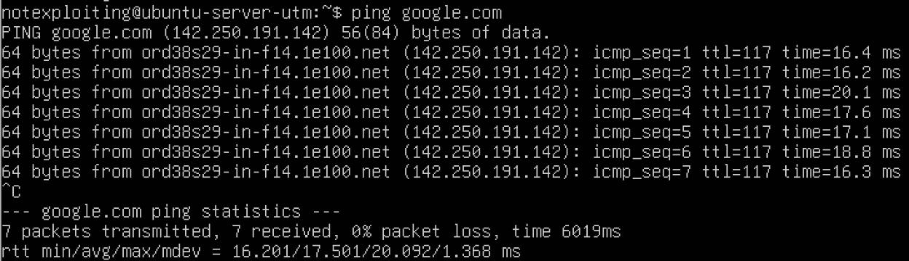

Alternatively, you can run the following command with the `-c` flag to send a specified number of packets.

```
ping -c 3 google.com
```

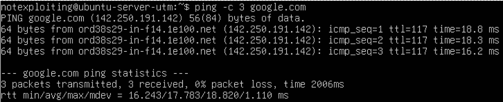

Next, we can also send packets to 8.8.8.8 in the same manner.

```
ping 8.8.8.8
```

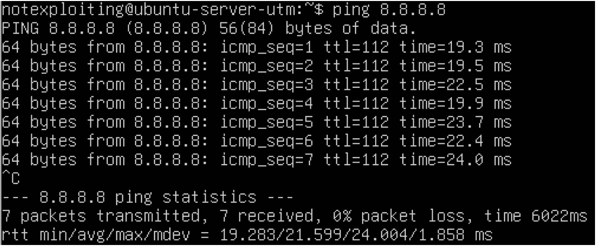

```
ping –c 3 8.8.8.8
```
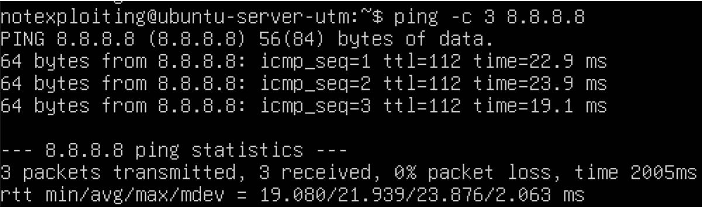

# Deploy WordPress on LAMP Stack

## Installing Apache and Updating the Firewall

Start by updating the package manager cache.

If it asks for the password, enter your password (side note: it may not look like it's entering, but it is)

```
sudo apt update
```

Then, install Apache with:

```
sudo apt install apache2
```

When prompted to confirm Apache's installation, confirm by typing `Y`, then `ENTER`.

Once the installation is finished, you'll need to adjust your firewall settings to allow HTTP traffic. We'll be leveraging the different application profiles in Ubuntu's default firewall configuration tool, Uncomplicated Firewall (UFW).

List all currently available UFW application profiles:

```
sudo ufw app list
```

Here's what each of the profiles mean:

- **Apache**: This profile opens only port `80` (normal, unencrypted web traffic).

- **Apache Full**: This profile opens both port 80 (normal, unencrypted web traffic) and port 443 (TLS/SSL encrypted traffic).

- **Apache Secure**: This profile opens only port 443 (TLS/SSL encrypted traffic).

For now, it’s best to allow only connections on port 80, since this is a fresh Apache installation and you don’t yet have a TLS/SSL certificate configured to allow for HTTPS traffic on your server.

Only allow traffic on port `80`, use the `Apache` profile:

```
sudo ufw allow in "Apache"
```

Verify the change with:

```
sudo ufw status
```

If your output says `Status: inactive`, run the following command to enable `ufw`:

```
sudo ufw enable
```

Run `sudo ufw status` once again and hopefully you see something like the following:

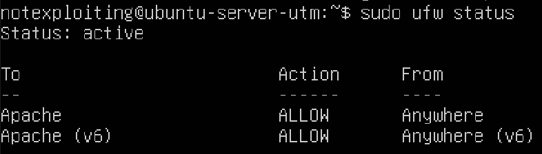

Ensure that 
Apache is running and active on the server:

```
sudo systemctl status apache2
```
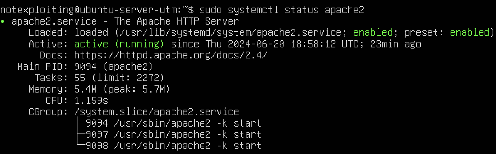

If Apache is not running, start it:

```
sudo systemctl start apache2
```

Now we can do a spot check. First, get your public IP address:

```
curl ifconfig.me
```

There should be a string of numbers before your server username. With this IP address in mind, go to your browser and enter the following address:

```
http://your_server_ip
```

You should be able to see the default Ubuntu Apache web page. For example: 
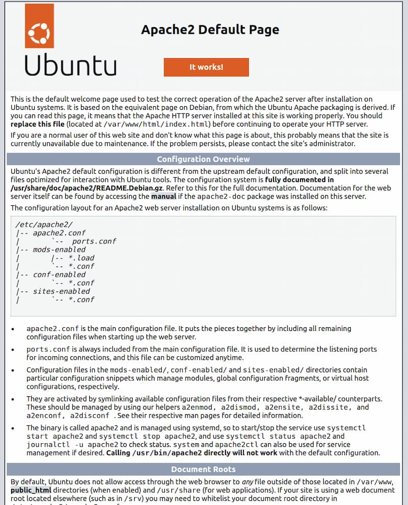

If you can view this page, your web server is correctly installed and accessible through your firewall.

*However*, you might not be able to load it completely (which is the case for me, since I'm using student residence wifi). You can instead try to load the page directly in the command line:
```
curl http://localhost
``` 

You should be able to see a bunch of HTML lines, like this:

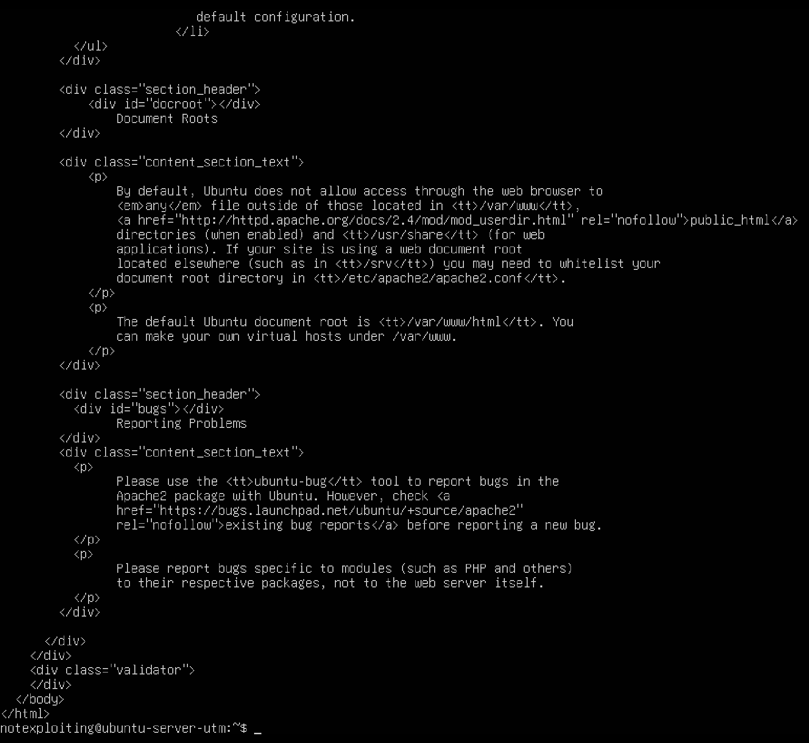

## Installing MySQL

You'll need to install a database system to be able to store and manage data for your site. MySQL is a popular database management system used within PHP environments

Install this software with `apt`:

```
sudo apt install mysql-server
```

When prompted to confirm the installation, confirm by typing `Y`, then `ENTER`.

Now we want to run a security script that removes some insecure default settings and lock down access to your database system.

`mysql_secure_installation` runs in a recursive loop, so we'll need to first adjust how your root MySQL user authenticates.

First, open up the MySQL Prompt:

```
sudo mysql
```

You should now see that the current line only says `mysql>`

Now change the **root** user's authentication to one that uses a password

```
ALTER USER 'root'@'localhost' IDENTIFIED WITH mysql_native_password BY 'password';
```

After making this change, exit the MySQL prompt:

```
exit
```

Now run the script (hopefully now without issue):

```
mysql_secure_installation`
```

When prompted, enter your password. By default (from the script above), the password is 'password'.

Read more on this [DigitalOcean tutorial](https://www.digitalocean.com/community/tutorials/how-to-install-lamp-stack-on-ubuntu) on the information regarding passwords and `VALIDATE PASSWORD COMPONENT`.

For the rest of the questions, press 'Y' and hit the 'ENTER' key at each prompt. This will remove some anonymous users and the test database, disable remote root logins, and load these new rules so that MySQL immediately respects the changes you have made. (I didn't do this because I didn't read the tutorial)

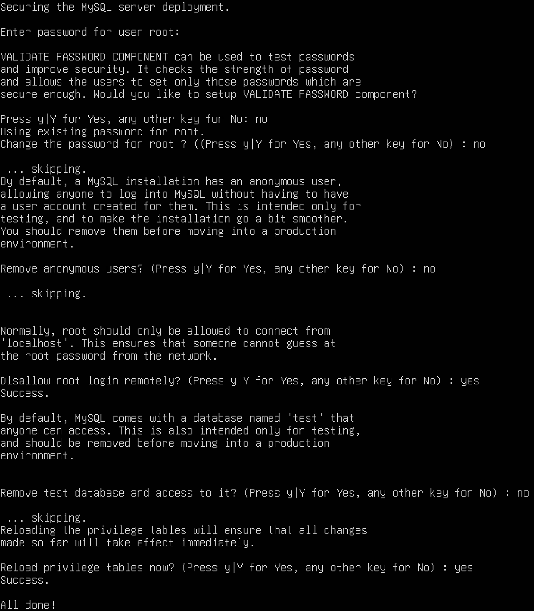